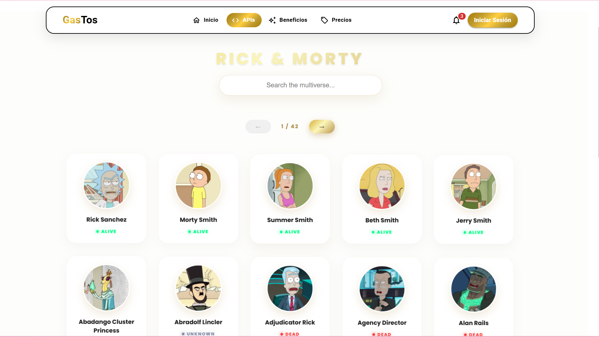

 App Gastos - Sistema de Gestión Financiera
*Evidencia Técnica:** Programa de Análisis y Desarrollo de Software (SENA).

 Descripción
App Gastos es una solución Fullstack desarrollada con el stack **MERN**. Su objetivo principal es permitir a los usuarios finales llevar un control centralizado de su economía personal. La aplicación facilita el registro de transacciones (ingresos y egresos), la gestión de perfiles de usuario y la visualización del flujo de caja mediante una interfaz intuitiva y responsiva.

---

 Características Principales
**Gestión de Usuarios:** Registro seguro y autenticación para proteger la privacidad de los datos.
**Control de Movimientos:** CRUD completo (Crear, Leer, Actualizar y Eliminar) para cada registro financiero.
**Interfaz MUI:** Diseño moderno basado en componentes de Material UI para una experiencia de usuario (UX) óptima.
**Base de Datos en la Nube:** Almacenamiento persistente y escalable mediante MongoDB Atlas.
**Arquitectura Modular:** Separación clara entre la lógica de negocio (Backend) y la interfaz de usuario (Frontend).

---

Tecnologías Utilizadas

Frontend
**React (Vite):** Biblioteca principal para la interfaz.
**Material UI (MUI):** Framework de diseño y componentes.
**Axios:** Consumo de la API REST.
**React Router Dom:** Gestión de navegación y rutas protegidas.

Backend
**Node.js & Express:** Servidor y entorno de ejecución.
**Mongoose:** Modelado de datos para MongoDB.
**Cors:** Configuración de seguridad para peticiones entre dominios.

---

 Arquitectura (Encarpetado)

El proyecto utiliza una estructura de **Separación de Responsabilidades**:
´´´markdown 
GASTOS/
├── app/                      # --- FRONTEND (React + Vite) ---
│   ├── src/
│   │   ├── feature/          # Módulos funcionales (Auth, Dashboard)
│   │   │   ├── apis/         # Definición de endpoints
│   │   │   ├── components/   # UI específica del módulo
│   │   │   └── services/     # Lógica de conexión (Axios)
│   │   ├── layout/           # Estructura global (Navbar, Sidebar, Footer)
│   │   ├── shared/           # Componentes y utilidades globales
│   │   ├── App.jsx           # Configuración de rutas
│   │   └── main.jsx          # Renderizado inicial
│   └── package.json
│
├── backend/                  # --- BACKEND (Node.js + Express) ---
│   ├── Config/               # Conexión a Base de Datos (db.js)
│   ├── Controllers/          # Funciones de lógica de negocio
│   ├── Models/               # Esquemas de Mongoose
│   ├── Routes/               # Definición de rutas (Endpoints)
│   ├── index.js              # Punto de entrada del servidor
│   └── .env                  # Variables de entorno (Sensible)
└── README.md
´´´

Instalación y Ejecución

git clone [https://github.com/estefany2239/Gastos.git](https://github.com/estefany2239/Gastos.git)
cd Gastos

cd backend
npm install
# Crea tu archivo .env con MONGO_URI y PORT
npm start

cd ../app
npm install
npm run dev

Datos del Autor

Nombre: Estefany Arango Morales

Institución: SENA - Centro de Servicios y Gestión Empresarial

Regional: Antioquia (Medellín)

Programa: Análisis y Desarrollo de Software

GitHub: estefany2239

